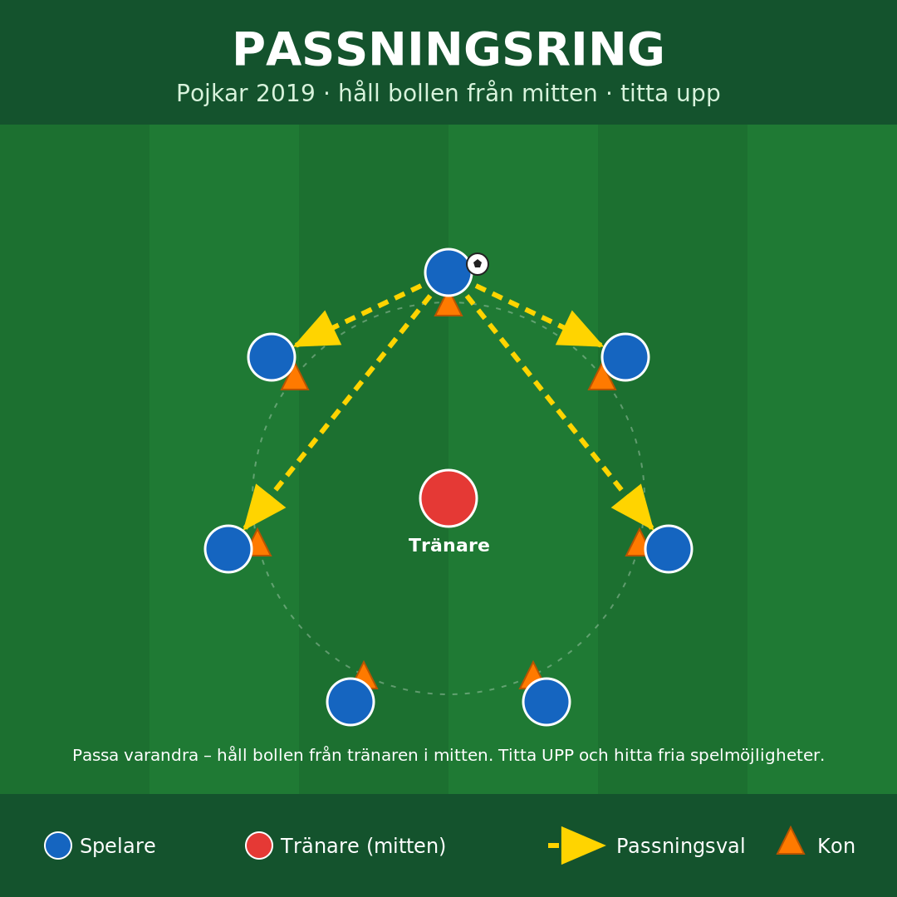
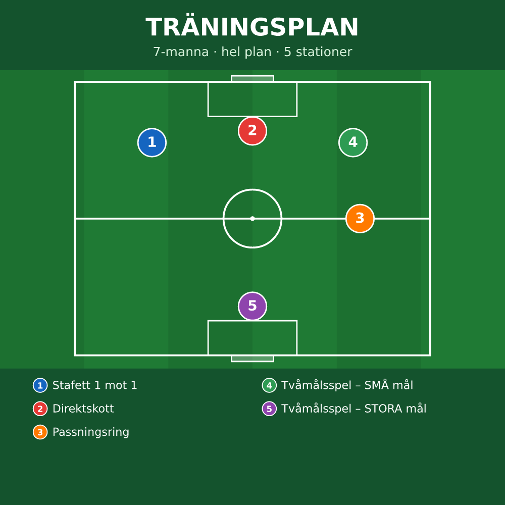

# ⚽ HeadCoach

> En WhatsApp-bot som postar träningsövningar (bild + förklaring) och en stationskarta direkt i lagets grupp. Byggd för ett barnfotbollslag (pojkar födda 2019).
>
> *A WhatsApp bot that posts football training drills (image + explanation) and a station map straight into the team chat.*

<p align="center">
  
  
</p>

En tränare skriver `/övningar` i gruppen → boten postar dagens övningar som bilder med förklaring. `/plan` ritar en stationskarta över planen. Tränaren styr vilka övningar som är aktiva direkt från chatten.

## ✨ Funktioner

- **Övningskort på kommando** — `/övningar` postar varje aktiv övning som bild + förklaring.
- **Stationskarta** — `/plan` ritar en utzoomad plan med övningarna utplacerade (7-manna hel plan; `/plan 11` ger halvplan för 11-manna).
- **Aktivera / avaktivera** — tränaren väljer och varierar övningar med `/aktivera` och `/avaktivera` (eller filen `aktiva.txt`).
- **Grupplås** — svarar bara i din laggrupp.
- **Spamskydd** — cooldown + dubblett-spärr så flera samtidiga kommandon inte spammar gruppen.
- **Inga API-nycklar** — loggar in via QR (WhatsApp Web) och körs lokalt på din dator.

## 🚀 Kom igång

Kräver **Node.js 20+**.

```bash
git clone <ditt-repo>
cd headcoach
npm install
cp config.example.json config.json    # Windows: copy config.example.json config.json
# öppna config.json och fyll i ert gruppnamn
npm start
```

Första gången visas en **QR-kod** i terminalen — skanna den i WhatsApp under **Inställningar → Länkade enheter → Länka en enhet**. Klart!

> Boten körs på din dator och svarar bara när datorn är på och vaken.

## 💬 Kommandon

| Kommando | Vad det gör |
|---|---|
| `/övningar` (el. `/träningar`) | Postar dagens aktiva övningar (bild + text) |
| `/lista` | Visar alla övningar med status ✅ aktiv / ⬜ inaktiv |
| `/plan` | Stationskarta — 7-manna (hel plan) |
| `/plan 11` | Stationskarta — 11-manna (halvplan) |
| `/hjälp` | Visar kommandolistan |
| `/aktivera <namn>` | *(tränaren)* slår PÅ en övning |
| `/avaktivera <namn>` | *(tränaren)* stänger AV en övning |

Kommandot måste stå **ensamt** i meddelandet — "Hej, testa /övningar" triggar inte. Tränar-kommandona fungerar bara från tränarens egen telefon.

## ➕ Lägg till en övning

1. Skapa en mapp under `drills/`, t.ex. `drills/dribbling-slalom/`.
2. Lägg i en **bild** (`.png`/`.jpg`) och en **`beskrivning.txt`** (första raden blir titeln).
3. `/aktivera dribbling-slalom` — eller skriv mappnamnet i `aktiva.txt`.

Ändringar i `drills/` och `aktiva.txt` gäller direkt, utan omstart.

## ⚙️ Konfiguration (`config.json`)

| Fält | Betydelse |
|---|---|
| `allowedGroupNames` | Lista med gruppnamn boten svarar i |
| `allowedGroup` | (Alternativ) exakt grupp-JID — loggas i terminalen när boten ser ett meddelande |
| `commands` | Kommandon som postar övningar |
| `sendDelayMs` | Paus mellan bilder (ms) |
| `cooldownSec` | Minsta antal sekunder mellan postningar per grupp |

Lämna `allowedGroupNames` och `allowedGroup` tomma för att svara överallt (testläge).

## ⚠️ Viktigt

HeadCoach loggar in som ditt eget WhatsApp-nummer via det inofficiella biblioteket [Baileys](https://github.com/WhiskeySockets/Baileys). Det bryter mot WhatsApps användarvillkor och innebär en liten risk att numret stängs av — använd gärna ett separat nummer. Mappen `auth_info/` är din inloggning och ligger i `.gitignore`; **dela eller committa den aldrig**.

Hobbyprojekt utan koppling till WhatsApp/Meta.

## 🗂️ Struktur

```
index.js              bot: anslutning, kommandon, grupplås, spamskydd
lib/drills.js         läser drills/ + aktiva.txt, kommandotolkning, aktiv/inaktiv
lib/plan.js           bygger stationskartan (/plan)
config.example.json   mall — kopiera till config.json
aktiva.txt            vilka övningar som är aktiva
drills/<namn>/        en mapp per övning: bild + beskrivning.txt
```

## 📄 Licens

[MIT](LICENSE) © Niclas Edling
